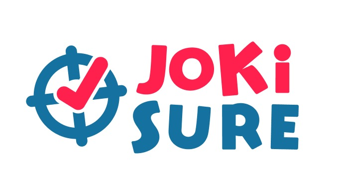

  

  <strong>The Ultimate Gaming Boost Platform</strong>

  A secure platform that connects gamers with verified boosters for reliable game boosting services.

  <em>Level up your gaming experience with trusted professionals!</em>

## Why Choose JokiSure?

**Tired of getting scammed by unreliable boosting services?** JokiSure is here to change the game!

JokiSure addresses the growing problem of fraud and lack of trust in the game boosting industry. Many gamers use "joki" (boosting) services to improve their game rankings but often face serious issues including scams, unverified service providers, lack of transparency, and difficulty trusting boosters with their gaming accounts.

**Our solution?** A secure, transparent platform where gamers can connect with verified boosters. We ensure your safety through an escrow payment system, real-time progress tracking, and a comprehensive rating and review system.

### What Makes Us Different
- **100% Secure Payments** - Your money is protected until service completion
- **Verified Professionals Only** - All boosters pass our strict verification process  
- **Real-Time Updates** - Watch your progress happen live
- **Transparent Reviews** - Real feedback from real customers

## Platform Workflow

The JokiSure platform operates through a streamlined process designed to ensure security and transparency:

1. **Account Registration** - Users create accounts with verified phone authentication
2. **Service Discovery** - Browse comprehensive game catalog and verified service providers  
3. **Provider Selection** - Review detailed booster profiles with performance metrics
4. **Service Configuration** - Add selected services to cart with customizable options
5. **Secure Transaction** - Complete payment through integrated escrow system
6. **Service Monitoring** - Track real-time progress with milestone notifications
7. **Direct Communication** - Maintain contact with service providers via integrated messaging
8. **Service Completion** - Submit feedback and ratings upon service fulfillment

This systematic approach ensures reliable service delivery while maintaining security protocols throughout the transaction lifecycle.

## Core Features

### **User Account Management**
- **User Registration** - Streamlined account creation process
- **Phone Verification** - Two-factor authentication via OTP system
- **Secure Authentication** - Protected login with session management
- **Profile Management** - Comprehensive user profile customization

### **Platform Navigation**
- **Game Catalog** - Comprehensive database of supported games
- **Booster Directory** - Detailed profiles with credentials and ratings
- **Service Listings** - Complete service descriptions with transparent pricing
- **Advanced Search** - Filtering and search functionality for efficient browsing

### **Transaction Management**
- **Cart System** - Multi-service selection and management
- **Dynamic Pricing** - Automated calculations with discount integration
- **Secure Checkout** - Protected payment processing workflow
- **Promotional System** - Discount code application and validation
- **Escrow Integration** - Secure payment holding until service completion

### **Service Delivery**
- **Progress Monitoring** - Real-time status tracking and updates
- **Communication Channel** - Direct messaging between users and service providers
- **Feedback System** - Comprehensive review and rating mechanism
- **Quality Assurance** - Service verification and quality control measures

## Key Differentiators

### **Escrow Payment System**
Our platform implements a secure escrow mechanism that holds payments until service completion, ensuring transaction security and protecting both parties from fraudulent activities.

### **Verified Booster Profiles**
All service providers undergo comprehensive verification processes including skill assessment and background checks to ensure professional service delivery standards.

### **Real-Time Progress Tracking**
The platform provides live status monitoring with milestone tracking and progress notifications, offering complete transparency throughout the service delivery process.

### **Reputation and Review System**
A comprehensive feedback mechanism enables users to make informed decisions based on authenticated reviews and performance ratings from verified transactions.

---

## Technology Stack

*Built with cutting-edge technology to ensure the best gaming experience.*

## Meet The Team

- **Aisya Candra Kirana Dewi** – 5026231002
- **Kanayya Shafa Amelia** – 5026231003  
- **Siti Qalimatus Zahra** – 5026231057
- **Zeldano Shan Oeffie** – 5026231118
- **Razza Ibrahmwibowo Muktiadi** – 5026231224

---

